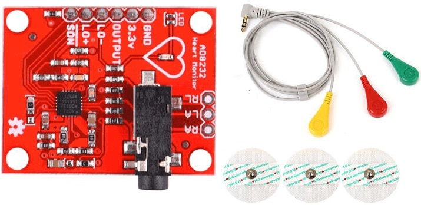
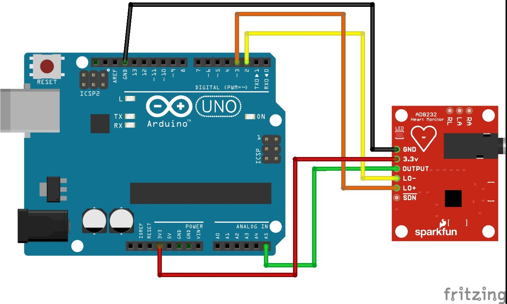
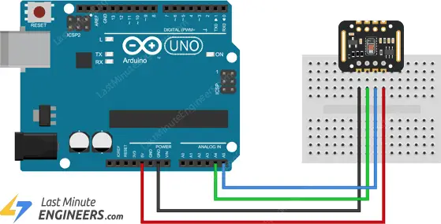
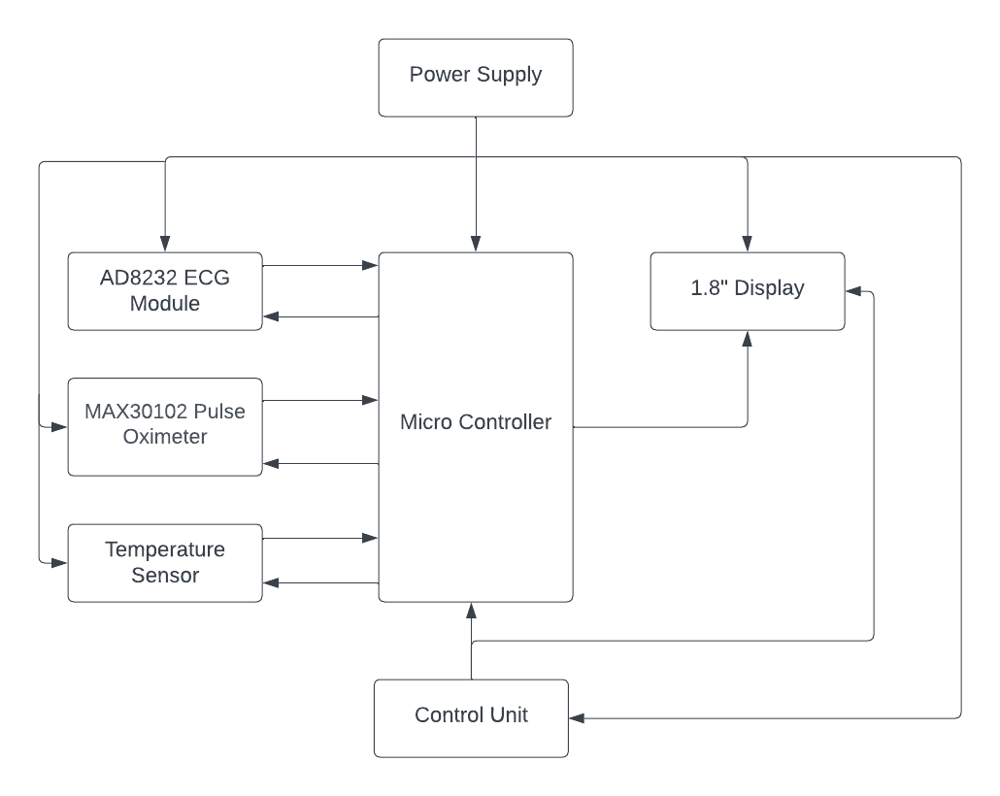

# Heart Sync- A Portable Vitals Monitor
## Contents

- [1 Problem Description and Solution](#1-problem-description-and-solution)
   - [1.1 Problem Identification](#11-problem-identification)
   - [1.2 Proposed solution](#12-proposed-solution)
- [2 Technical feasibility](#2-technical-feasibility)
   - [2.1 ECG graphing + Heart rate module](#21-ecg-graphing--heart-rate-module)
   - [2.2 Pulse oximeter + temperature module](#22-pulse-oximeter--temperature-module)
   - [2.3 LCD Display module](#23-lcd-display-module)
   - [2.4 Rechargable power module](#24-rechargable-power-module)
- [3 Product architecture](#3-product-architecture)
   - [3.1 The Micro-controller unit](#31-the-micro-controller-unit)
   - [3.2 The Power Supply](#32-the-power-supply)
   - [3.3 Sensors](#33-sensors)
      - [3.3.1 Heart beat sensor](#331-heart-beat-sensor)
      - [3.3.2 Pulse Oximeter](#332-pulse-oximeter)
      - [3.3.3 Temperature Sensor](#333-temperature-sensor)
   - [3.4 The Display](#34-the-display)
- [4 PCB Design](#4-pcb-design)
- [5 Enclosure design](#5-enclosure-design)
   - [5.1 Design sketches](#51-design-sketches)
   - [5.2 Final enclosure design](#52-final-enclosure-design)
- [6 Functioning of the device prototype](#6-functioning-of-the-device-prototype)
- [7 Future improvements](#7-future-improvements)
- [8 Resources](#8-resources)

## 1 Problem Description and Solution

### 1.1 Problem Identification

The elderly and paralyzed individuals often face difficulties in making frequent visits
to the hospital for checkups, which can be both time-consuming and expensive.
In emergency situations, managing multiple cumbersome medical devices becomes
challenging. Moreover, those with critical health conditions require regular health
monitoring while traveling, which becomes more convenient with access to a compact
device containing all essential measuring instruments.

The vital parameters of the body that can be measured include heart rate, ECG,
blood oxygen level, and body temperature. In clinical settings, these parameters are
continuously monitored using a complex multi-parameter monitoring device. How-
ever, these devices are difficult to operate due to the involvement of numerous cables,
probes, and calibration processes. They are also inconvenient to transport between
different locations. Furthermore, for individuals without a medical background, us-
ing such a multi-parameter monitoring device can be confusing and complicated.

### 1.2 Proposed solution

Therefore, we present an electronic product that combines the capabilities of mea-
suring all the vital parameters mentioned above. Our Portable Medikit device is
designed to be compact and simple to use. It is intended to be user-friendly for both
medical professionals and individuals without a medical background.

We brand ourselves asMediTronicswhile branding our product asHeartSyncVital
Monitor. Our device is a handheld multi-parameter monitor. It is built upon a
micro-controller embedded system utilizing body parameter monitoring sensors like
ECG and pulse oximeter.

## 2 Technical feasibility

To analyze the technical feasibility of our product, we will look at the working of each
of its fundamental modules. As our product is an integration of all these modules
into one portable device, we can thus ensure its feasibility of design and manufacture.
In this analysis, we will investigate the feasibility of building simple circuits using
an Arduino development board. Thus, if such circuits are craftable, we can inte-
grate all of them into one PCB operated using an Atmega328P micro-controller unit.

### 2.1 ECG graphing + Heart rate module

The functionality of getting the Electrocardiogram graph plotted on a screen can be
achieved through the use of the AD8232 ECG sensor module. This sensor provides
an analog output which can be processed by the micro-controller to display the
signal against time graph on a display module. The heart rate (BPM) can also be
calculated using this analog input and can be displayed on the screen.

<table>
  <tr>
    <td>
      
    </td>
    <td>
      
    </td>
  </tr>
</table>

### 2.2 Pulse oximeter + temperature module

The functionality of displaying the blood oxygen level is achieved by using a MAX
Pulse Oximeter Sensor. The working of this module can be demonstrated through
a simple Arduino development board. The MAX30102 module provides analog out-
puts which can be processed by the Atmega328p microcontroller to calculate body
parameters such as blood oxygen level (SpO2) and heart rate. The MAX30201 mod-
ule includes an inbuilt temperature sensor which can be used to take measurements
of the body temperature as well.

 

### 2.3 LCD Display module

The processed outputs can be displayed or drawn to a screen using a 1.8” TFT Color
Screen LCD display module. This display is adequate for plotting the ECG graph
as well as displaying the measurement mode and other textual data.

### 2.4 Rechargable power module

Since our product is a portable device it should be operable without electrical supply
connectivity. Therefore we propose to include a power module consisting of two
1000mAh 3.7V Li-ion batteries. The power supply to all sensors and the processing
unit is provided by this power module. Hence, it should regulate the total 7.4V
voltage into 5V. This can be achieved using a standard 5V Voltage regulator available
in the market (L7805CV).

## 3 Product architecture

The block diagram of the proposed product architecture is as follows.

 

### 3.1 The Micro-controller unit

This microcontroller, an Atmega328-Pu, has been programmed to generate the nec-
essary signals. These signals control how the sensors function and how the mea-
surements are shown on the display. Due to its adaptability and simplicity of use,
the Atmega328-Pu microcontroller is a popular option for many embedded systems
projects. It has a clock speed of up to 20 MHz and is based on the AVR archi-
tecture. A broad variety of peripherals are also included, including timers, serial
communication interfaces, analog-to-digital converters, and digital I/O pins. This
unit will be programmed so that when the button is pressed, we can select the mode
we want, and depending on the mode we select, we can measure the blood’s oxygen
saturation, temperature, or ECG.

### 3.2 The Power Supply

In order to make the device functional, we use two rechargeable 3.7V (18650) Li-
ion batteries in the power supply. We convert the 7.4 V to 5 V using a voltage
regulator and supply it to the micro-controller unit. The power supply will be
directly connected to each sensor. Using batteries is the best option if you need to
use this item in an emergency.

### 3.3 Sensors

#### 3.3.1 Heart beat sensor

A module that can be used to gauge and keep track of the electrical activity of
the heart is the AD8232 Pulse Heart ECG Monitoring Sensor. It is frequently em-
ployed in medical settings to diagnose and track heart problems. The Analog devices
AD8232 chip, a single-lead heart rate monitor front-end, serves as the module’s foun-
dation. High-quality ECG signal capture, filtering, and amplification are provided
by the chip. The AD8232 chip, a power source, and a selection of electrodes make
up the AD8232 Pulse Heart ECG Monitoring Sensor module. In order to detect the
electrical activity of the heart, the electrodes are employed to secure the module to
the skin. The module offers a standard output signal that a microcontroller or other
processing device can read. It runs between 3 and 5 volts.

#### 3.3.2 Pulse Oximeter

A small, highly integrated sensor module called the MAX30102-MAX30100 pulse
oximeter can be used to gauge the blood’s oxygen saturation levels. This is based
on the high-quality pulse oximetry and heart rate monitoring of the MAX30102 and
MAX30100 chips. The module has a number of LEDs and photodetectors that are
used to gauge how much light blood absorbs. The MAX30102-MAX30100 pulse
oximeter is perfect for wearable and portable medical monitoring applications due
to its tiny form factor and low power consumption.

#### 3.3.3 Temperature Sensor

The MAX30102-MAX30100 sensor has a temperature sensor that offers precise tem-
perature measurements in real-time that are simple for a microcontroller or other
host device to read and process. It is feasible to monitor a person’s or animal’s health
and well-being by taking their temperature and making adjustments as needed to
maximize performance and avoid harm or disease.

### 3.4 The Display

The 1.8” TFT color screen LCD display module with ST7735 interface SPI is a
small and high-resolution display module that can be easily interfaced with a micro-
controller or other host device. Its compact size and simple interface make it ideal
for use in a wide range of embedded systems projects, while its high resolution and
full color palette make it perfect for displaying images and graphics. The onboard
voltage regulator and backlight control circuit make it easy to use and integrate into
any application.

## 4 PCB Design

We have used Altium software to design our PCB. The following are the schematic
and PCB Layouts that we developed. During our development procedure we referred
to data sheets of the components used to identify their specifications.

## 5 Enclosure design

### 5.1 Design sketches

Since our selling point is the portability of the monitoring device, we decided to
make the enclosure as compact and handheld. The following are our progress on
deciding on an enclosure design.

### 5.2 Final enclosure design

We used SolidWorks software to model our enclosure design idea. We printed the
designed SolidWorks model using a 3D printing service to realize our design.

## 6 Functioning of the device prototype

Our device operates using 5 buttons including the power button. We have crafted
a user manual to specify the operation of the device. This also includes how to
position and mount the ECG probes and electrodes. The following is a draft of the
user manual

## 7 Future improvements

Linking the output of the vital monitoring device to a mobile app via
IoT: By doing so, the device can transmit real-time data to a dedicated mobile app,
enabling healthcare professionals and caregivers to remotely monitor the patient’s
vital signs. This connectivity enhances the accessibility of data.

Added functionality of measuring other parameters such as blood pres-
sure and sugar level: Expanding the device’s capabilities to include additional
parameters like blood pressure and sugar level monitoring extends its utility and en-
hances its clinical value. This enables comprehensive health monitoring and provides
a more comprehensive picture of the patient’s overall health condition.

Fine-tuning and improving the accuracy of measurements: We noticed that
there are some inconsistencies when measuring BPM using our device. Achiev-
ing high precision in vital parameter measurements is crucial for reliable patient
monitoring. Future improvements may focus on refining the device’s sensors and
algorithms to ensure greater accuracy and consistency in data readings.

Implementing a bigger screen: A larger and more user-friendly display screen
can significantly improve the device’s usability. With a bigger screen, medical pro-
fessionals and caregivers can easily view and interpret vital data without straining
their eyes. The enhanced screen size allows for better visualization of trends, graphs,
and alerts, making it more convenient to access essential information quickly.

## 8 Resources

Document containing sensors and component data
[Link to Google Docs](https://docs.google.com/document/d/1s87Qr7RW8MkDu91iFnWbZ_XUwXPSMAfhFd_
zcGGMo1w/edit)
